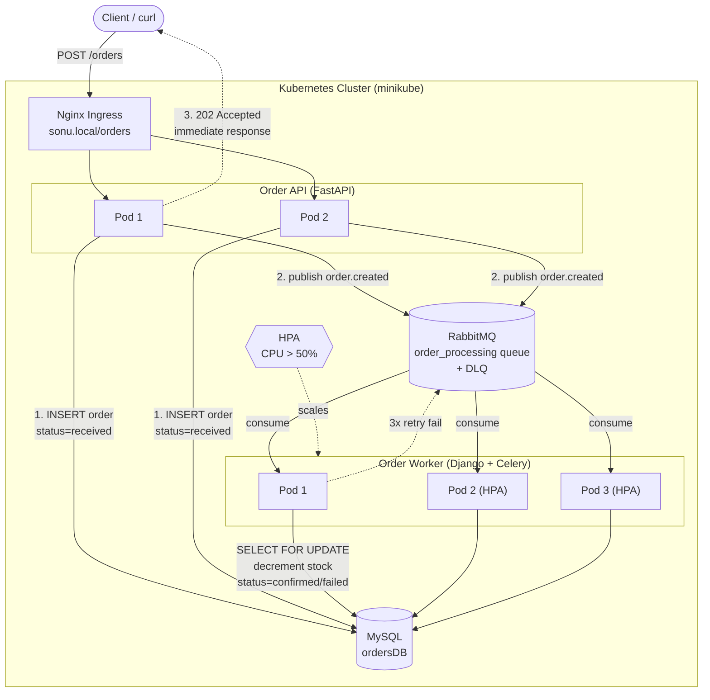
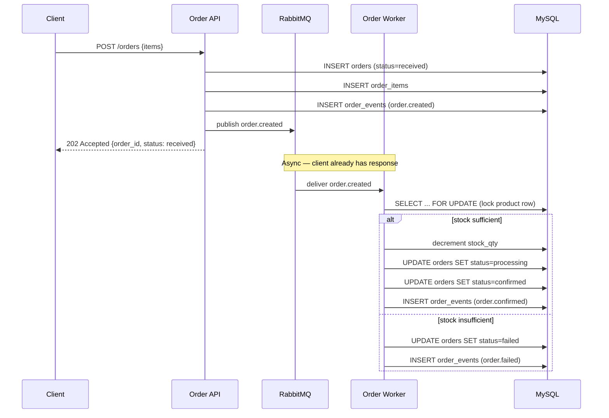
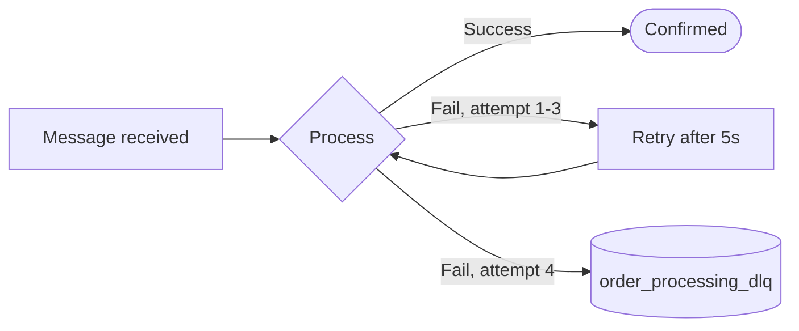
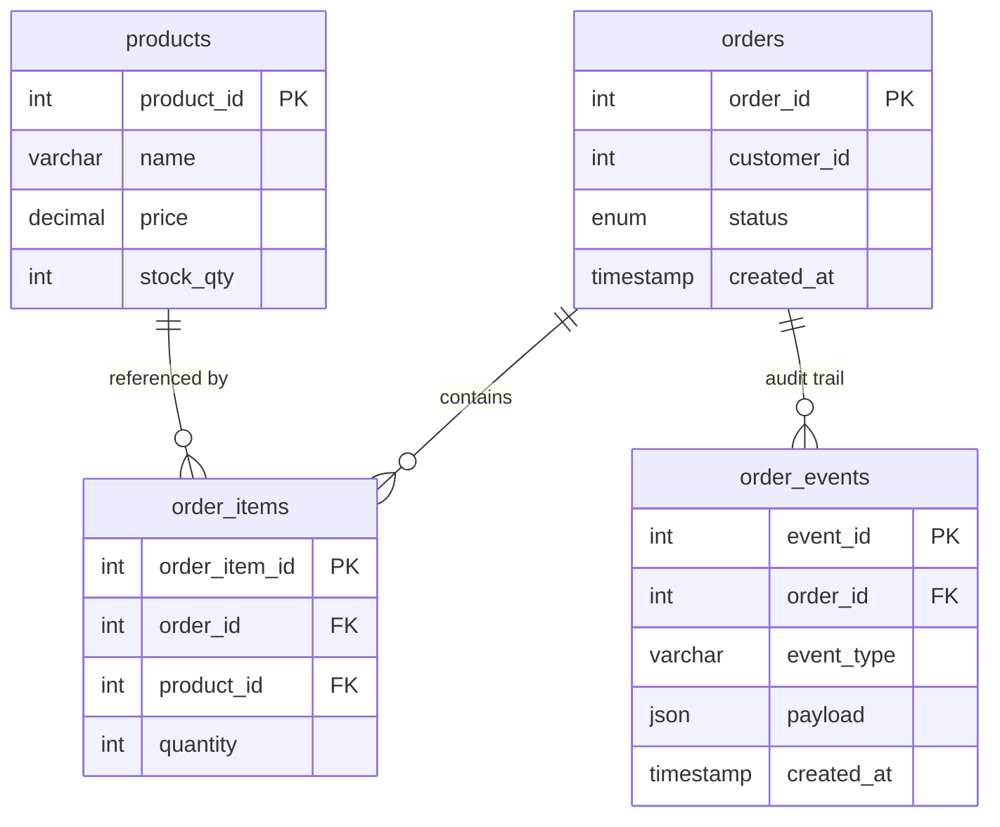
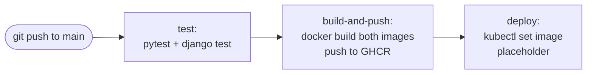

# E-Commerce Order Processing System

**Asynchronous, message-queue driven order processing pipeline.**

When a customer places an order, the API responds immediately (`202 Accepted`) without waiting for inventory checks, payment, or notifications — those steps happen in the background via RabbitMQ, with retry and dead-letter handling. Built to demonstrate distributed system design, containerization, and orchestration.

---

## Table of Contents

1. [Architecture](#architecture)
2. [Stack](#stack)
3. [Database Schema](#database-schema)
4. [Project Structure](#project-structure)
5. [Step-by-Step Setup](#step-by-step-setup)
6. [Application Design](#application-design)
7. [Failure Handling Tests](#failure-handling-tests)
8. [Kubernetes Deployment](#kubernetes-deployment)
9. [Nginx Ingress](#nginx-ingress)
10. [Horizontal Pod Autoscaler (HPA)](#horizontal-pod-autoscaler-hpa)
11. [CI/CD Pipeline](#cicd-pipeline)
12. [Test Results Summary](#test-results-summary)

---

## Architecture



### Request Flow



### Failure Handling: Retry → DLQ



---

## Stack

| Component | Technology |
|---|---|
| Order API | FastAPI |
| Order Worker | Django + Celery |
| Database | MySQL 8.0 |
| Message Broker | RabbitMQ (management plugin) |
| Containerization | Docker (multi-stage builds) |
| Orchestration | Kubernetes (minikube) |
| Ingress | Nginx Ingress Controller |
| CI/CD | GitHub Actions |
| Registry | GitHub Container Registry (GHCR) |

---

## Database Schema



`order_events.payload` is a native MySQL **JSON column** — it stores the raw message for every state transition, forming a replay-able audit log.

**Row-locking:** stock decrements use `SELECT ... FOR UPDATE` inside a DB transaction, so two simultaneous orders for the last unit in stock cannot both succeed.

---

## Project Structure

```
ecommerce-order-processing-system/
├── order-api/          FastAPI service
│   ├── main.py
│   ├── db.py
│   ├── mq.py
│   ├── Dockerfile
│   └── requirements.txt
├── order-worker/       Django + Celery service
│   ├── orders/
│   │   ├── models.py
│   │   ├── tasks.py
│   │   └── tests.py
│   ├── order_worker/
│   │   ├── settings.py
│   │   ├── celery.py
│   │   └── urls.py
│   ├── Dockerfile
│   └── requirements.txt
├── k8s/                Kubernetes manifests
│   ├── namespace.yaml
│   ├── configmap.yaml
│   ├── secret.yaml
│   ├── mysql.yaml
│   ├── rabbitmq.yaml
│   ├── order-api.yaml
│   ├── order-worker.yaml
│   ├── hpa.yaml
│   └── ingress.yaml
├── db/
│   └── schema.sql
├── docs/screenshots/   Test evidence
└── .github/workflows/
    └── ci-cd.yml
```

---

## Step-by-Step Setup

### 1. Clone and scaffold

```bash
git clone https://github.com/sonujha78/ecommerce-order-processing-system.git
cd ecommerce-order-processing-system
```

### 2. MySQL schema

`db/schema.sql` defines `products`, `orders`, `order_items`, `order_events` and seeds three products — including `Last-Item Widget` with `stock_qty=1`, used for the race-condition test.

Run locally with Docker for development:

```bash
docker network create order-net

docker run -d --name mysql-orders --network order-net \
  -e MYSQL_ROOT_PASSWORD=rootpass -e MYSQL_DATABASE=ordersDB \
  -p 3306:3306 \
  -v $(pwd)/db/schema.sql:/docker-entrypoint-initdb.d/schema.sql \
  mysql:8.0
```

**Result:**
```
+------------------+
| Tables_in_ordersDB |
+------------------+
| order_events     |
| order_items      |
| orders           |
| products         |
+------------------+
```

### 3. RabbitMQ

```bash
docker run -d --name rabbitmq --network order-net \
  -p 5672:5672 -p 15672:15672 \
  rabbitmq:3-management
```

Management UI: `http://localhost:15672` (guest/guest)

### 4. Order API (FastAPI)

```bash
cd order-api
python3 -m venv venv && source venv/bin/activate
pip install fastapi uvicorn pymysql celery python-dotenv
uvicorn main:app --reload --host 0.0.0.0 --port 8000
```

**Test:**
```bash
curl -X POST http://localhost:8000/orders \
  -H "Content-Type: application/json" \
  -d '{"customer_id": 1, "items": [{"product_id": 1, "quantity": 2}]}'
```
**Result:** `{"order_id":1,"status":"received"}` — HTTP 202, immediate response.

### 5. Order Worker (Django + Celery)

```bash
cd order-worker
python3 -m venv venv && source venv/bin/activate
pip install django celery pymysql kombu python-dotenv
celery -A order_worker worker --loglevel=info -Q order_processing
```

**Result:**
```
[tasks]
  . orders.tasks.process_order
[... celery@jha ready.]
```

Sending an order now shows in the worker log:
```
Task orders.tasks.process_order[...] received
orders.tasks.process_order[...]: Order 2 confirmed.
Task ... succeeded in 0.062s
```

---

## Application Design

### Order API — `POST /orders`

1. Validates the request.
2. Inserts an `orders` row with status `received`.
3. Inserts `order_items` and an `order.created` event (JSON payload).
4. Publishes `order.created` to RabbitMQ.
5. Returns `202 Accepted` with the order ID — **does not wait for processing.**

### Order Worker — Celery task `process_order`

- Consumes `order.created` from RabbitMQ.
- **Idempotency check:** if the order is already `confirmed`/`failed`, a redelivered message is a no-op.
- Inside a DB transaction: locks the product row (`SELECT ... FOR UPDATE`), checks stock, decrements it, and transitions `received → processing → confirmed`.
- Insufficient stock → `failed` immediately (business failure, not retried).
- Any other exception → retried up to 3 times (5s apart); on the 4th failure the order is marked `failed` and the message is published to `order_processing_dlq`.
- `CELERY_TASK_ACKS_LATE = True` and `CELERY_WORKER_PREFETCH_MULTIPLIER = 1` ensure a crash mid-task leaves the message unacked, so RabbitMQ redelivers it once the worker restarts — no order is lost.

---

## Failure Handling Tests

### Test 1 — Stock Race Condition

Two simultaneous orders for `Last-Item Widget` (`stock_qty=1`):

```bash
curl -s -X POST http://localhost:8000/orders -d '{"customer_id":101,"items":[{"product_id":3,"quantity":1}]}' &
curl -s -X POST http://localhost:8000/orders -d '{"customer_id":102,"items":[{"product_id":3,"quantity":1}]}' &
wait
```

**Result:**

| Order | Status | Reason |
|---|---|---|
| 3 | `confirmed` | Acquired the row lock first |
| 4 | `failed` | `"Insufficient stock for product 3"` |

Final stock: `stock_qty = 0` — exactly zero, proving no double-sell.

### Test 2 — Crash & Recover

1. Worker stopped (`Ctrl+C`).
2. Order placed → stays `"status": "received"` (message sits in RabbitMQ).
3. Worker restarted → message picked up automatically.

**Result:** order transitions to `"status": "confirmed"` on restart — **no order lost.**

### Test 3 — Dead Letter Queue

A message referencing a non-existent `order_id` is sent directly via Celery to force repeated failure:

```python
from order_worker.celery import app
app.send_task("orders.tasks.process_order", args=[{"order_id": 9999, "customer_id": 1, "items": []}], queue="order_processing")
```

**Result (worker log):**
```
attempt 1/4 → retry in 5s
attempt 2/4 → retry in 5s
attempt 3/4 → retry in 5s
attempt 4/4 → WARNING: Order 9999 not found in DB — sending straight to DLQ
             → ERROR: Order 9999 sent to DLQ
             → Task succeeded: 'Order 9999 moved to DLQ after max retries'
```

No infinite retry loop, no unhandled crash. Verified in RabbitMQ UI: `order_processing_dlq` queue shows 1 message.

> **Implementation note:** retry counting is done manually via `self.request.retries` rather than relying on Celery's `MaxRetriesExceededError`, because Celery re-raises the *original* exception (not `MaxRetriesExceededError`) when `self.retry(exc=e)` is called with an explicit exception on the final attempt.

---

## Kubernetes Deployment

### Cluster setup

```bash
minikube start --driver=docker --cpus=4 --memory=6144
minikube addons enable ingress
minikube addons enable metrics-server
```

### Build and load images

```bash
eval $(minikube docker-env -u)   # build with host Docker
docker build -t order-api:v1 ./order-api
docker build -t order-worker:v1 ./order-worker
minikube image load order-api:v1
minikube image load order-worker:v1
```

### Apply manifests

```bash
kubectl apply -f k8s/namespace.yaml
kubectl apply -f k8s/configmap.yaml
kubectl apply -f k8s/secret.yaml
kubectl apply -f k8s/mysql.yaml
kubectl apply -f k8s/rabbitmq.yaml
kubectl apply -f k8s/order-api.yaml
kubectl apply -f k8s/order-worker.yaml
kubectl apply -f k8s/hpa.yaml
kubectl apply -f k8s/ingress.yaml
```

**Result:**
```
NAME                        READY   STATUS    RESTARTS   AGE
mysql-7fcdd5fd47-6shbr      1/1     Running   0          5h
order-api-74994c66d5-96klr  1/1     Running   0          2m
order-api-74994c66d5-f8gpz  1/1     Running   0          2m
order-worker-98f6596f5-...  1/1     Running   0          1m
rabbitmq-787bc47688-9vsgd   1/1     Running   0          15m
```

Manifests include:
- **ConfigMap / Secret** for non-secret config vs. DB/RabbitMQ credentials.
- **PersistentVolumeClaim** for MySQL data.
- **Readiness & liveness probes** — HTTP `/health` for the API, `celery inspect ping` for the worker.
- **Resource requests/limits** on every container (tuned after an initial `OOMKilled` under load — worker memory raised to `256Mi/512Mi` requests/limits and Celery concurrency capped at `4`).
- `imagePullPolicy: Never` — images are loaded locally into minikube rather than pulled from a registry.

---

## Nginx Ingress

```yaml
apiVersion: networking.k8s.io/v1
kind: Ingress
metadata:
  name: order-api-ingress
  namespace: ecommerce
spec:
  ingressClassName: nginx
  rules:
    - host: sonu.local
      http:
        paths:
          - path: /orders
            pathType: Prefix
            backend:
              service:
                name: order-api-service
                port:
                  number: 8000
```

```bash
echo "$(minikube ip) sonu.local" | sudo tee -a /etc/hosts
curl -X POST http://sonu.local/orders -d '{"customer_id":401,"items":[{"product_id":2,"quantity":1}]}'
```

**Result:** `{"order_id":2,"status":"received"}` — traffic flows through Ingress → Service → Pod correctly.

---

## Horizontal Pod Autoscaler (HPA)

```yaml
apiVersion: autoscaling/v2
kind: HorizontalPodAutoscaler
metadata:
  name: order-worker-hpa
  namespace: ecommerce
spec:
  scaleTargetRef:
    apiVersion: apps/v1
    kind: Deployment
    name: order-worker
  minReplicas: 1
  maxReplicas: 5
  metrics:
    - type: Resource
      resource:
        name: cpu
        target:
          type: Utilization
          averageUtilization: 50
```

### Load test

```bash
for i in $(seq 1 300); do
  curl -s -X POST http://sonu.local/orders \
    -d "{\"customer_id\": $i, \"items\": [{\"product_id\": 2, \"quantity\": 1}]}" &
done
wait
```

**Result (`kubectl get hpa -n ecommerce -w`):**

| CPU % vs target | Replicas |
|---|---|
| 40%/50% | 1 |
| 85%/50% | 1 → **2** |
| 133%/50% | 2 → **3** |

HPA scaled worker pods automatically as CPU crossed the 50% threshold, and would scale back down to 1 once load subsides (default 5-minute stabilization window).

---

## CI/CD Pipeline

`.github/workflows/ci-cd.yml` — triggered on every push to `main`:



1. **test** — runs `pytest` for the Order API and `python manage.py test` for the Order Worker.
2. **build-and-push** — builds both Docker images and pushes them to GitHub Container Registry (`ghcr.io/<owner>/order-api`, `order-worker`), tagged with both `latest` and the commit SHA.
3. **deploy** — since the cluster is a local minikube instance with no public endpoint reachable from GitHub's runners, this stage documents (rather than fakes) the real command a cloud-hosted cluster would run:
   ```bash
   kubectl set image deployment/order-api order-api=<image>:<sha> -n ecommerce
   kubectl set image deployment/order-worker order-worker=<image>:<sha> -n ecommerce
   ```

**Result:** all three jobs green — `test` (18s) → `build-and-push` (57s) → `deploy` (40s), total 2m 4s.

---

## Test Results Summary

| # | Test | Result |
|---|---|---|
| 1 | Order flow `received → processing → confirmed` | ✅ Pass |
| 2 | Stock-race: 2 simultaneous orders, last unit in stock | ✅ One confirmed, one failed, stock=0 (no double-sell) |
| 3 | Crash-recover: worker killed mid-queue, restarted | ✅ Order stays `received`, then correctly processes on restart |
| 4 | Dead-letter queue: message fails repeatedly | ✅ Retries 3×, then routed to `order_processing_dlq`, no infinite loop |
| 5 | Nginx Ingress path-based routing | ✅ `sonu.local/orders` reaches the API through the cluster |
| 6 | HPA autoscaling under load | ✅ Scaled 1 → 2 → 3 replicas as CPU crossed 50% target |
| 7 | CI/CD pipeline | ✅ test → build+push to GHCR → deploy, all green |

Screenshot evidence for each test is in [`docs/screenshots/`](./docs/screenshots).

---

## Why This Was a Different Kind of Challenge

Unlike a synchronous locking problem (preventing two things from happening at once), this system had to **guarantee eventual success despite failure** — crashes, at-least-once redelivery, and partial failures — using asynchronous messaging instead of direct request/response. That meant designing for idempotency, dead-letter routing, and autoscaling from the start, not bolting them on afterward.
